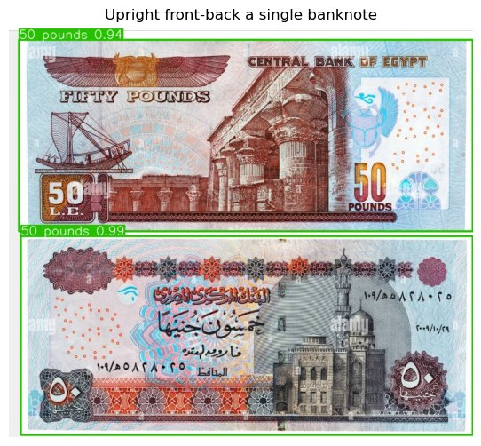
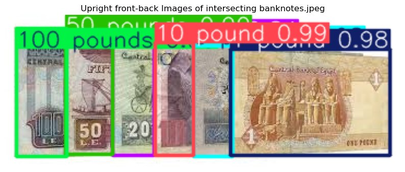
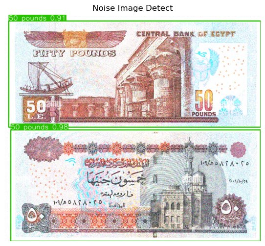

# Egyptian Banknote Detection & Counting — YOLOv8

[](https://colab.research.google.com/github/AsserGharib1/EgyptianBanknoteDetectionYOLOV8/blob/main/egyptian_banknote_detection_yolov8.ipynb)
[](https://nbviewer.org/github/AsserGharib1/EgyptianBanknoteDetectionYOLOV8/blob/main/egyptian_banknote_detection_yolov8.ipynb)

> **Viewing tip:** GitHub truncates the inline preview of large notebooks (this one preserves all training outputs). Use the **nbviewer** badge above to read it fully rendered in the browser, or **Colab** to open it interactively.


Fine-tuned YOLOv8 detector that recognizes and counts Egyptian banknotes in images, robust to overlap, rotation, poor illumination, and noise.

## Results (validation set)

| Metric | Score |
|---|---|
| mAP@50 | **0.994** |
| mAP@50-95 | **0.95** |
| Precision | 0.957 |
| Recall | 0.984 |

## Robustness evaluation

Validated across **7 test scenarios**, with annotated prediction outputs preserved in the notebook:

1. Single upright banknote (front/back)
2. Multiple non-intersecting banknotes
3. Overlapping / intersecting banknotes
4. All-in-one rotated arrangement
5. Slightly rotated frames
6. Poor illumination
7. Injected image noise

## Detection examples

Single upright banknote:



Overlapping banknotes:



Noisy input:



## Repository contents

- `egyptian_banknote_detection_yolov8.ipynb` — training, inference, and all seven robustness experiments with visual outputs.

## Running

```bash
pip install -r requirements.txt
```

Point the config cell at a YOLO-format Egyptian currency dataset (e.g., the Roboflow *EgyCurrency* dataset), train with Ultralytics, then run the inference cells. Trained weights are not included due to size.
